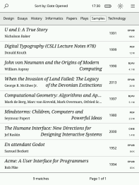
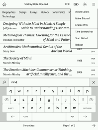
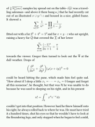
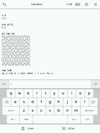

This is an optimized version of the original [Plato](https://github.com/pettarin/plato) document reader for Kobo e-readers.

*Plato* is a document reader for *Kobo*'s e-readers.

Documentation: [GUIDE](doc/GUIDE.md), [MANUAL](doc/MANUAL.md), [BUILD](doc/BUILD.md), [NOT_IMPLEMENTED](doc/NOT_IMPLEMENTED.md) and [OCR_TTS](doc/OCR_TTS.md).

## Supported firmwares

Any 4.*X*.*Y* firmware, with *X* ≥ 6, will do.

## Supported devices

- *Libra Colour*.
- *Clara Colour*.
- *Clara BW*.
- *Elipsa 2E*.
- *Clara 2E*.
- *Libra 2*.
- *Sage*.
- *Elipsa*.
- *Nia*.
- *Libra H₂O*.
- *Forma*.
- *Clara HD*.
- *Aura H₂O Edition 2*.
- *Aura Edition 2*.
- *Aura ONE*.
- *Glo HD*.
- *Aura H₂O*.
- *Aura*.
- *Glo*.
- *Touch C*.
- *Touch B*.

## Supported formats

- PDF, CBZ, FB2, MOBI, XPS and TXT via [MuPDF](https://mupdf.com/index.html).
- ePUB through a built-in renderer.

## Features

- Crop the margins.
- Continuous fit-to-width zoom mode with line preserving cuts.
- Rotate the screen (portrait ↔ landscape).
- Adjust the contrast.
- Define words using *dictd* dictionaries.
- Annotations, highlights and bookmarks with notes.
- Export annotations to Markdown or JSON format.
- Retrieve articles from online sources through [hooks](doc/HOOKS.md) (an example *wallabag* [article fetcher](doc/ARTICLE_FETCHER.md) is provided).
- RTL (Right-to-Left) text support for Arabic, Hebrew, and Persian languages.
- Dark mode support for night reading.
- Reading progress and statistics tracking with reading time and streaks.
- Reading goals (daily minutes, weekly books).
- Notes and sketch applications.
- Metadata viewing for documents.
- Book collections and series support.
- Custom gesture configuration.
- Night light scheduling with automatic warm light transitions.
- Manga/comic mode with RTL page turning.
- **Batch operations** (multi-select books for delete/move).
- Book preview on long press.
- Password-protected document support (auto-handled via MuPDF).
- **Cover editor** for customizing book covers.
- Plugin system for extensible hooks with network access control.
- **Background WiFi sync** with WebDAV cloud synchronization.
- **KoboCloud sync** for reading progress.
- External SD card auto-import support.
- **Statistics view** to track reading progress and streaks.
- **EPUB Editor** with undo/redo and preview functionality.
- **MuPDF native search** option for PDF text search.
- **PDF Tools** for page deletion, rotation, extraction, merging, reordering, redaction, resource extraction, and annotation export.
- **Progressive document loading** with LRU caching for large PDFs.
- **Redaction support** for securely removing content from PDFs.
- **Resource extraction** for analyzing images and fonts in PDFs.
- **Export annotations to PDF** - Embed highlights/notes in new PDF file.

[](artworks/screenshot01.png) [](artworks/screenshot02.png) [](artworks/screenshot03.png) [](artworks/screenshot04.png)

### Optimizations

- **Build System** - Resolved linker failures by expanding `mupdf_wrapper.c` with 20+ custom FFI functions (PDF manipulation, annotations, redactions, image/font extraction); wrapper is now automatically linked via `build.rs`
- **AArch64 (ARM64)** - Added support for newer Kobo devices (Libra 2, Sage, Clara 2E, Elipsa 2E, etc.)
- **Error Handling** - Improved robustness with proper error handling instead of `unwrap()`
- **Memory** - Optimized string building with pre-allocated buffers, fixed memory availability detection, reduced thumbnail memory by 75% (grayscale instead of RGBA), reduced MuPDF context cache from 32MB to 16MB, fixed Pixmap OOM panics, optimized pixmap creation to avoid double allocation
- **PDF** - Added auto-crop margins feature for scanned documents, PDF/A detection, annotation reading and export
- **Rendering** - Added minimum font size support for better readability
- **ePUB** - Enhanced HTML engine with improved font handling
- **CSS** - Full CSS support including border, background, text-transform, text-decoration, tab-size
- **ARM** - Added NEON SIMD and VFP4 optimizations for 32-bit Kobo devices
- **Framebuffer** - Added `#[inline]` to all pixel operations for faster rendering
- **Geometry** - Added `#[inline]` to Point, Vec2, Rectangle methods for faster calculations
- **Document** - Added `#[inline]` to PDF page methods and font metrics
- **Device** - Added `#[inline]` to all device capability methods
- **Input** - Added `#[inline]` to button status conversion

For a detailed list of features not yet implemented, see [NOT_IMPLEMENTED](doc/NOT_IMPLEMENTED.md).

### Build Targets

```bash
# Build for 32-bit ARM (original Kobo devices)
cargo build --profile release-arm

# Build for 64-bit ARM (newer Kobo devices like Libra 2, Sage)
cargo build --target aarch64-unknown-linux-gnu --profile release-arm64
```

### Credits

This project is based on the excellent work of the original Plato developer. See the [upstream project](https://github.com/pettarin/plato) for the original implementation.

## Donations

[](https://www.paypal.com/cgi-bin/webscr?cmd=_s-xclick&hosted_button_id=KNAR2VKYRYUV6)
