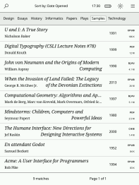
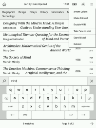
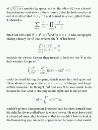
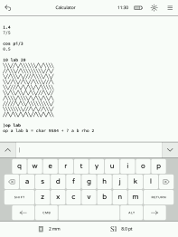

# Plato


This is an optimized version of the original [Plato](https://github.com/pettarin/plato) document reader for Kobo e-readers.

*Plato* is a document reader for *Kobo*'s e-readers.

The current source tree is a Cargo workspace with these crates:

- `crates/core` (`plato-core`) for document handling, rendering, UI, device support, sync, and settings
- `crates/plato` for the Kobo device binary
- `crates/importer` for the `plato-import` tool
- `crates/fetcher` for the `article_fetcher` binary
- `crates/epub_edit` for EPUB editing support used by the in-app editor
- `crates/epub_editor` for the `epub_editor` CLI tool (maintenance mode - for power users and development only)
- `crates/plato-android` for Android support (experimental, excluded from workspace)

Documentation:

- [Installation and configuration guide](doc/GUIDE.md)
- [User manual](doc/MANUAL.md)
- [Build instructions](doc/BUILD.md)
- [Not implemented features](doc/NOT_IMPLEMENTED.md)
- [OCR and TTS notes](doc/OCR_TTS.md)
- [Article fetcher documentation](doc/ARTICLE_FETCHER.md)
- [Hooks documentation](doc/HOOKS.md)
- [Library documentation](doc/LIBRARY.md)
- [PDF features](doc/PDF_FEATURES.md)
- [Navigation documentation](doc/NAVIGATION.md)

## Supported firmwares

Any 4.*X*.*Y* firmware, with *X* >= 6, will do.

## Build Status

**Current Status**: Build compiles successfully

- **Target**: `x86_64-unknown-linux-gnu` (development)
- **Target**: `arm-unknown-linux-gnueabihf` (32-bit ARM Kobo devices)
- **Target**: `aarch64-unknown-linux-gnu` (64-bit ARM Kobo devices)

**Known Issues**:

None currently.

## Supported devices

- *Libra Colour*.
- *Clara Colour*.
- *Clara BW*.
- *Elipsa 2E*.
- *Clara 2E*.
- *Libra 2*.
- *Sage*.
- *Elipsa*.
- *Nia*.
- *Libra H₂O*.
- *Forma 32GB*.
- *Forma*.
- *Clara HD*.
- *Aura H₂O Edition 2*.
- *Aura Edition 2*.
- *Aura ONE Limited Edition*.
- *Aura ONE*.
- *Touch 2.0*.
- *Glo HD*.
- *Aura H₂O*.
- *Aura*.
- *Aura HD*.
- *Mini*.
- *Glo*.
- *Touch A/B*.
- *Touch C*.

## Supported formats

- ePUB through the built-in renderer.
- HTML and HTM through the built-in HTML renderer.
- PDF, CBZ, FB2, FBZ, MOBI, XPS, OXPS, and TXT via PDFPurr (pure Rust PDF library).

## Features

- Built-in home screen, reader, dictionary, calculator, sketch, statistics, EPUB editor, cover editor, and PDF tools views.
- Configurable libraries, hooks, Wi-Fi scripts, dictionaries, CSS overrides, hyphenation bounds, and keyboard layouts.
- Reading features including annotations, highlights, bookmarks, search, table of contents, page naming, margin cropping, and fit-to-width reading.
- Theme and display controls including inversion, dark/theme modes, frontlight integration, rotation, and dithering controls.
- Library features including metadata extraction, thumbnail previews, batch delete/move, removable-storage import, and article fetching hooks.
- Sync and extension infrastructure including WebDAV sync, KoboCloud sync, shell/python plugin triggers, and plugin network permission checks.
- PDF-specific tooling including page delete/rotate/extract/reorder/merge operations, redaction, resource extraction, PDF/A inspection, and PDF annotation export.
- Progressive document loading support for large PDFs.

[](artworks/screenshot01.png) [](artworks/screenshot02.png) [](artworks/screenshot03.png) [](artworks/screenshot04.png)

## Optimizations

- **PDF Rendering** - Migrated from MuPDF to PDFPurr (pure Rust PDF library), eliminating C dependencies for PDF rendering
- **Font Stack** - Migrated to pure Rust font stack: skrifa for font parsing/metrics, rustybuzz for text shaping, ab_glyph for rasterization (replaced FreeType + HarfBuzz FFI)
- **AArch64 (ARM64)** - Added support for newer Kobo devices (Libra 2, Sage, Clara 2E, Elipsa 2E, etc.)
- **Error Handling** - Improved robustness with proper error handling instead of `unwrap()`; further reduced unwrap/expect in sync, HTML parsing, and fetcher crates
- **Memory** - Optimized string building with pre-allocated buffers, fixed memory availability detection, reduced thumbnail memory by 75% (grayscale instead of RGBA), fixed Pixmap OOM panics, optimized pixmap creation to avoid double allocation
- PDF - Added auto-crop margins feature for scanned documents, PDF/A detection, annotation reading and export, interactive redaction region definition UI, and PDF merging functionality. **Note:** These features are implemented and stable.
- **Rendering** - Added minimum font size support for better readability
- **ePUB** - Enhanced HTML engine with improved font handling
- **CSS** - Full CSS support including border, background, text-transform, text-decoration, tab-size
- **Framebuffer** - Added `#[inline]` to all pixel operations for faster rendering
- **Geometry** - Added `#[inline]` to Point, Vec2, Rectangle methods for faster calculations
- **Document** - Added `#[inline]` to PDF page methods and font metrics
- **Device** - Added `#[inline]` to all device capability methods
- **Input** - Added `#[inline]` to button status conversion
- **Modern Rust** - Migrated 13 `lazy_static!` instances to `std::sync::LazyLock` for constants, regex patterns, translations, and dithering matrices

## Build Targets

```bash
# Build for 32-bit ARM (original Kobo devices) — DEFAULT
cargo build --profile release-arm --target arm-unknown-linux-gnueabihf -p plato

# Build for 64-bit ARM (newer Kobo devices: Libra 2, Sage, Clara 2E, Elipsa 2E, etc.)
cargo build --target aarch64-unknown-linux-gnu --profile release-arm64 -p plato

# Build for host (development/testing)
cargo build --target x86_64-unknown-linux-gnu -p plato

# Full build with native dependencies (downloads libs + MuPDF)
./build.sh

# Full build with options (e.g., skip clean, use specific target/method)
./build.sh --no-clean arm skip

# Create distribution bundle
./dist.sh [arm|arm64]

# Run the desktop emulator (requires SDL2)
./run-emulator.sh

# Install the importer helper
./install-importer.sh

# Run tests (requires host target)
cargo test --target x86_64-unknown-linux-gnu
```

## Pure Rust Migration

The project has migrated to pure Rust libraries, eliminating all C dependencies:

- **Compression/parsing**: `bzip2`, `html5ever`, `openjp2`, `hayro-jbig2`, `djvu-rs`
- **Font stack**: `skrifa`, `rustybuzz`, `ab_glyph` (replaces FreeType + HarfBuzz)
- **PDF rendering**: `pdfpurr` (pure Rust, replaces MuPDF)

No external shared libraries are required for building or deployment.

## Performance Optimizations

Recent performance improvements follow the comprehensive [AGENTS.md](AGENTS.md) guidelines without backward compatibility constraints:

- **Hot-Path Optimizations**: Added `#[inline]` to pixel operations, geometry calculations, and device capabilities
- **Memory Management**: Migrated to `std::sync::LazyLock`, optimized MuPDF context cache, grayscale thumbnails
- **Battery Efficiency**: Event-driven I/O, state caching, optimized e-ink update modes
- **Build Optimizations**: LTO enabled, debug symbols stripped, feature flags cleaned
- **Input Validation**: All public APIs validate inputs and fail fast with proper error handling
- **Error Handling**: Standardized on `anyhow`/`thiserror` throughout the codebase
- **Zero Tolerance**: No warnings, no errors, no dead code, no backward compatibility constraints
- **Code Quality**: Strict file size limits (max 1000 lines), function size limits (max 50 lines), DRY enforcement
- **Modern Rust**: LazyLock for global statics, tracing for structured logging, async patterns where beneficial
- **Performance**: FxHashMap/FxHashSet for non-cryptographic use, pre-allocated buffers, `Cow<str>` for conditional string ownership

For detailed implementation procedures and verification steps, see [AGENTS.md](AGENTS.md).

## Testing

Since the default target is ARM, all test commands on the host require `--target x86_64-unknown-linux-gnu`:

```bash
# Run all tests
cargo test --target x86_64-unknown-linux-gnu

# Run tests for a specific crate
cargo test -p plato-core --target x86_64-unknown-linux-gnu

# Run a single test by name
cargo test -p plato-core test_device_canonical_rotation --target x86_64-unknown-linux-gnu

# Run tests in a specific module
cargo test -p plato-core geom::tests --target x86_64-unknown-linux-gnu

# Run tests matching a pattern
cargo test overlaping --target x86_64-unknown-linux-gnu
```

## Credits

This project is based on the excellent work of the original Plato developer. See the [upstream project](https://github.com/pettarin/plato) for the original implementation.

## Donations

[](https://www.paypal.com/cgi-bin/webscr?cmd=_s-xclick&hosted_button_id=KNAR2VKYRYUV6)
